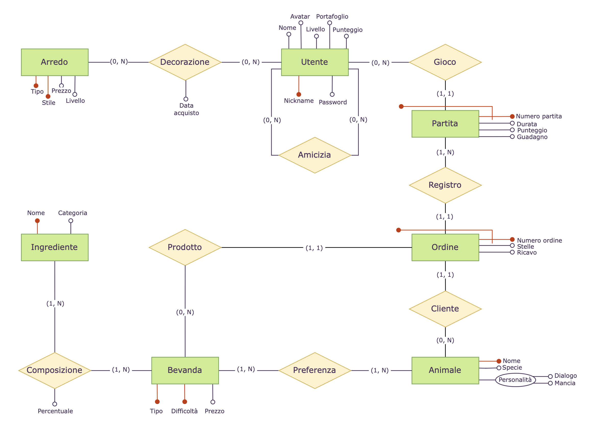
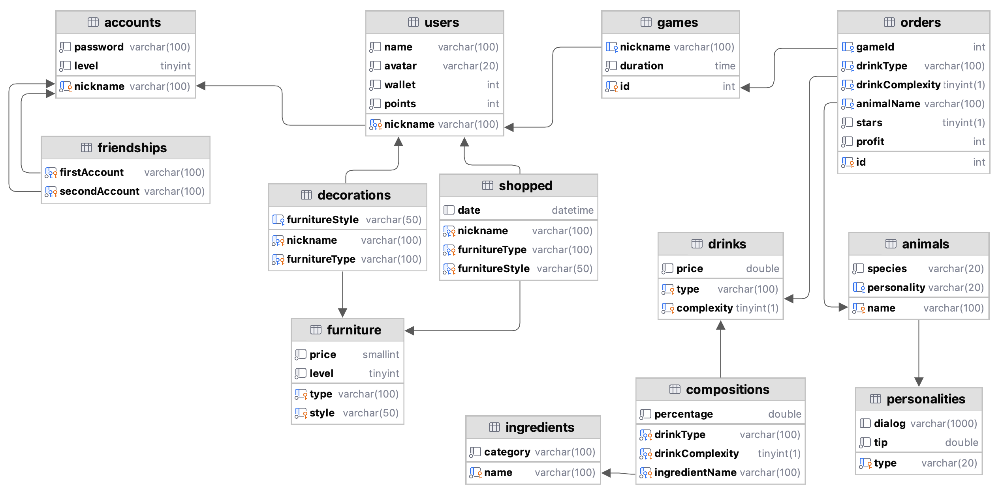

*Università degli Studi di Trieste - Dipartimento di Ingegneria e Architettura*

# Animal Café

### Progetto di Basi di Dati

IN0501184

**Anna Guccione**

Maggio 2024

# 1. Presentazione del progetto <a name="1"></a>

## 1.1. Introduzione

Si intende realizzare un database destinato a supportare "Animal Café", un'ipotetica applicazione mobile di gioco di tipo simulazione, in cui gli utenti sono proprietari di un bar frequentato da animali antropomorfi, ispirati al famoso gioco "Animal Crossing". 

### Contesto

Durante la partita, l'utente deve versare gli ingredienti dell'ordine effettuato dal cliente uno a uno, cercando di raggiungere precisamente la quantità richiesta dal cliente. Per ogni ordine vengono calcolate le stelle e il prezzo totale della bevanda. Le stelle corrispondono al numero di ingredienti di cui si è rispettata precisamente la percentuale richiesta dal cliente. Il prezzo totale della singola bevanda viene calcolato a partire dal prezzo base della bevanda, aggiungendo la mancia del cliente per ogni stella ottenuta.

Alla fine della partita vengono calcolati il punteggio e il guadagno totale. Il punteggio corrisponde alla somma delle stelle ottenute. Il guadagno corrisponde alla somma dei prezzi di ogni bevanda venduta a cui viene sottratta la somma delle spese sulle materie prime. 

Il punteggio dell'utente viene aggiornato ad ogni fine partita, sommandoci quello ottenuto. Raggiunto un certo punteggio si aumenta di livello.

### Requisiti del database

Ogni **utente** del gioco possiede un profilo, caratterizzato da un nome, un avatar, il livello di esperienza e un portafoglio virtuale. Gli utenti possono accedere con un nickname e una password, e stringere amicizia con altri utenti.

I giocatori possono avviare una **partita** all'interno del gioco, ambientata nel proprio bar, ciascuna caratterizzata da una durata, dal denaro guadagnato e da un punteggio totale. 

Ogni **cliente** del bar è un animale, identificato da un nome, da una specie, da una personalità, che influisce sul suo dialogo di interazione e sulla mancia che può dare. Durante le partite, ciascun cliente effettua un **ordine**, che è caratterizzato dal tipo di bevanda, dal prezzo finale e dalle stelle che l'utente ottiene durante il gioco.

Il menù del bar comprende una varietà di **bevande**, ognuna caratterizzata da un tipo, da un prezzo e da una difficoltà. La bevanda è composta da un certo numero di **ingredienti** che possono essere presenti in percentuali variabili e che sono caratterizzati da un nome e da una categoria.

Il livello dell'utente aumenta in base al **punteggio**. Aumentare di livello determina l'accesso ad acquisti nello shop di nuovi arredi per il bar, ognuno caratterizzato da un tipo, uno stile, un prezzo e dal livello di accesso.


## 1.2. Glossario dei termini

<table style="page-break-inside: auto;">
        <thead>
            <tr>
                <th>Termine</th>
                <th>Definizione</th>
                <th>Sinonimi</th>
                <th>Collegamento</th>
            </tr>
        </thead>
        <tbody>
            <tr>
                <td>Utente</td>
                <td>Account della persona che si iscrive nel gioco</td>
                <td>Giocatore</td>
                <td>Partita, Bar, Portafoglio</td>
            </tr>
            <tr>
                <td>Bar</td>
                <td>Luogo in cui è ambientata la partita</td>
                <td></td>
                <td>Utente, Arredo</td>
            </tr>
            <tr>
                <td>Punteggio</td>
                <td>Esperienza dell'utente ottenuta dalle partite</td>
                <td></td>
                <td>Utente, Partita</td>
            </tr>
            <tr>
                <td>Portafoglio</td>
                <td>Bilancio dell'utente</td>
                <td></td>
                <td>Utente</td>
            </tr>
            <tr>
                <td>Partita</td>
                <td>Giornata di gioco nel bar</td>
                <td></td>
                <td>Utente, Ordini</td>
            </tr>
            <tr>
                <td>Animale</td>
                <td>Cliente che ordina una bevanda al bar</td>
                <td>Clienti</td>
                <td>Bevande, Ordini</td>
            </tr>
            <tr>
                <td>Ingrediente</td>
                <td>Elemento che compone la bevanda</td>
                <td></td>
                <td>Bevande</td>
            </tr>
            <tr>
                <td>Bevande</td>
                <td>Prodotti descritti nel menù</td>
                <td>Prodotti</td>
                <td>Animale, Ingredienti, Ordini</td>
            </tr>
            <tr>
                <td>Ordini</td>
                <td>Ordinazione della bevanda effettuata dal cliente</td>
                <td></td>
                <td>Partita, Animale, Bevande, Stelle</td>
            </tr>
              <tr>
                <td>Stelle</td>
                <td>Punteggio dell'utente su ogni ordine</td>
                <td>Punteggio</td>
                <td>Punteggio, Ordini</td>
            </tr>
            <tr>
                <td>Arredo</td>
                <td>Decorazioni per il bar che si possono comprare</td>
                <td></td>
                <td>Bar</td>
            </tr>
        </tbody>
    </table>

# 2. Schema concettuale

## 2.1. Diagramma Entity-Relationship



## 2.2. Dizionario dei dati

### Entità
<table style="page-break-inside: auto;">
  <thead>
    <tr>
      <th>Nome</th>
      <th>Descrizione</th>
      <th>Attributi</th>
      <th>Identificatore</th>
    </tr>
  </thead>
  <tbody>
    <tr>
      <td>Utente</td>
      <td>Account della persona che si iscrive nel gioco</td>
      <td>Nome, Avatar, Livello, Portafoglio, Punteggio, Nickname, Password</td>
      <td>Nome</td>
    </tr>
        <tr>
      <td>Arredo</td>
      <td>Prodotto decorativo per il bar</td>
      <td>Tipo, Stile, Prezzo, Livello</td>
      <td>Tipo, Stile</td>
    </tr>
    <tr>
      <td>Partita</td>
      <td>Giornata di gioco nel bar</td>
      <td>Numero partita, Durata, Punteggio, Guadagno</td>
      <td>Numero partita, Gioco (R)</td>
    </tr>
    <tr>
      <td>Ordine</td>
      <td>Singola richiesta di una bevanda da parte di un cliente</td>
      <td>Numero ordine, Stelle, Ricavo</td>
      <td>Numero ordine, Registro (R)</td>
    </tr>
    <tr>
      <td>Animale</td>
      <td>Cliente che ordina una bevanda al bar</td>
      <td>Nome, Specie, Personalità</td>
      <td>Nome</td>
    </tr>
    <tr>
      <td>Bevanda</td>
      <td>Prodotto descritto nel menù</td>
      <td>Tipo, Difficoltà, Prezzo</td>
      <td>Tipo, Difficoltà</td>
    </tr>
    <tr>
      <td>Ingrediente</td>
      <td>Elemento che compone la bevanda</td>
      <td>Nome, Categoria</td>
      <td>Nome</td>
    </tr>
  </tbody>
</table>

### Relationship

<table style="page-break-inside: auto;">
  <thead>
    <tr>
      <th>Nome</th>
      <th>Descrizione</th>
      <th>Componenti</th>
      <th>Attributi</th>
    </tr>
  </thead>
  <tbody>
    <tr>
      <td>Amicizia</td>
      <td>Rapporto tra due account</td>
      <td>Utente</td>
      <td></td>
    </tr>
     <tr>
      <td>Decorazione</td>
      <td>L'utente può decorare il proprio bar con degli arredi</td>
      <td>Utente, Arredo</td>
      <td>Data acquisto</td>
    </tr>
    <tr>
      <td>Gioco</td>
      <td>L'utente gioca a una partita</td>
      <td>Utente, Partita</td>
      <td></td>
    </tr>
    <tr>
      <td>Registro</td>
      <td>In una partita si registra una sequenza di ordini</td>
      <td>Partita, Ordine</td>
      <td></td>
    </tr>
    <tr>
      <td>Cliente</td>
      <td>Il cliente dell'ordine è un animale</td>
      <td>Ordine, Animale</td>
      <td></td>
    </tr>
    <tr>
      <td>Preferenza</td>
      <td>L'animale ha delle bevande di preferenza</td>
      <td>Animale, Bevanda</td>
      <td></td>
    </tr>
    <tr>
      <td>Prodotto</td>
      <td>Il prodotto richiesto in un ordine è una bevanda</td>
      <td>Ordine, Bevanda</td>
      <td></td>
    </tr>
    <tr>
      <td>Composizione</td>
      <td>La bevanda è composta da più ingredienti</td>
      <td>Bevanda, Ingrediente</td>
      <td>Percentuale</td>
    </tr>
  </tbody>
</table>

## 2.3. Vincoli non espirimibili graficamente

- Il rapporto di amicizia tra due account dev'essere simmetrico.
- In una sequenza d'ordine di una partita, uno stesso cliente compare solo una volta.
- Il livello del giocatore viene aumentato al raggiungimento di un certo punteggio.
- Il bar può essere decorato da al massimo un arredo per tipo.
- Il portafoglio dell'utente non può avere un bilancio negativo.


# 3. Progettazione logica

## 3.1. Operazioni d'interesse

<table style="page-break-inside: auto;">
  <thead>
    <tr>
      <th><strong>Azione</strong></th>
      <th><strong>Tipo</strong></th>
      <th><strong>Frequenza</strong></th>
    </tr>
  </thead>
  <tbody>
     <tr>
      <td>Generazione di una partita</td>
      <td>Interattiva</td>
      <td>3/giorno</td>
    </tr>
    <tr>
      <td>Gestione degli ordini di una partita</td>
      <td>Interattiva</td>
      <td>15/giorno</td>
    </tr>
    <tr>
      <td>Decorazione del bar con un arredo acquistato</td>
      <td>Interattiva</td>
      <td>1/settimana</td>
    </tr>
    <tr>
      <td>Visualizzazione della classifica amici</td>
      <td>Interattiva</td>
      <td>1/settimana</td>
    </tr>
     <tr>
      <td>Registrazione di una partita</td>
      <td>Batch</td>
      <td>3/giorno</td>
    </tr>
    <tr>
    <td>Pulizia dei dati storici di partite e ordini</td>
      <td>Batch</td>
      <td>1/settimana</td>
    <tr>
      <td>Report mensile degli account che utilizzano l'app</td>
      <td>Batch</td>
      <td>1/mese</td>
    </tr>
  </tbody>
</table>

## 3.2. Tavola dei volumi

<table style="page-break-inside: auto;">
  <thead>
    <tr>
      <th>Concetto</th>
      <th>Tipo</th>
      <th>Volume</th>
    </tr>
  </thead>
  <tbody>
    <tr>
      <td>Utente</td>
      <td>E</td>
      <td>2.000</td>
    </tr>
    <tr>
      <td>Amicizia</td>
      <td>R</td>
      <td>3.000</td>
    </tr>
    <tr>
      <td>Decorazione</td>
      <td>R</td>
      <td>10</td>
    </tr>
    <tr>
      <td>Arredo</td>
      <td>E</td>
      <td>100</td>
    </tr>
    <tr>
      <td>Gioco</td>
      <td>R</td>
      <td>4.000</td>
    </tr>
    <tr>
      <td>Partita</td>
      <td>E</td>
      <td>4.000</td>
    </tr>
    <tr>
      <td>Registro</td>
      <td>R</td>
      <td>20.000</td>
    </tr>
    <tr>
      <td>Ordine</td>
      <td>E</td>
      <td>20.000</td>
    </tr>
    <tr>
      <td>Prodotto</td>
      <td>R</td>
      <td>20.000</td>
    </tr>
    <tr>
      <td>Cliente</td>
      <td>R</td>
      <td>20.000</td>
    </tr>
    <tr>
      <td>Bevanda</td>
      <td>E</td>
      <td>30</td>
    </tr>
    <tr>
      <td>Animale</td>
      <td>E</td>
      <td>400</td>
    </tr>
    <tr>
      <td>Preferenza</td>
      <td>R</td>
      <td>1.600</td>
    </tr>
    <tr>
      <td>Composizione</td>
      <td>R</td>
      <td>60</td>
    </tr>
    <tr>
      <td>Ingredienti</td>
      <td>E</td>
      <td>10</td>
    </tr>
  </tbody>
</table>

## 3.3. Ristrutturazione

### Analisi delle ridondanze

- **Analisi dell'attributo Punteggio in Partita** 

  Si osserva che l'attributo punteggio in *Partita* è la somma delle stelle degli *Ordini* di una stessa partita e inoltre che l'attributo *Punteggio* di *Utente* è la somma dei punteggi delle partite. Si decide di eliminare l'attributo *Punteggio* in *Partita* in quanto calcolabile e poiché, considerando l'operazioni "Registrazione di una partita", l'accesso aggiuntivo di scrittura in *Partita* risulta superfluo. 

  Tuttavia si decide di mantenerlo in *Utente* per ottimizzare l'operazione di aumento di livello automatico. 

- **Analisi dell'attributo Guadagno in Partita**

  Per lo stesso ragionamento, si osserva che l'attributo *Guadagno* di *Partita* è ridondante in quanto somma dei ricavi dei singoli ordini. Quindi si decide di toglierlo per evitare l'accesso aggiuntivo di scrittura in *Partita*.

- **Analisi dei cicli**
  Si vede che c'è un ciclo *Ordine-Cliente-Animale-Preferenza-Bevanda-Prodotto-Ordine*, per cui si decide di eliminare la relazione n-aria *Preferenza* in quanto facilmente ricavabile dalle altre relazioni e possibile appesantimento del sistema.

### Partizionamento di entità o relazioni

- **Partizionamento verticale di entità**

  Ci si accorge che gli attributi di *Utente* sono divisibili in due categorie: quelli riferiti all'utente in partita e quelli riferiti al suo account online. Si decide di creare una seconda entità *Account* e di unirle con la relazione uno a uno *Online*. Gli attributi di online saranno *Nickname*, *Password* e *Livello*; ad Account sarà inoltre associata la relazione ricorsiva *Amicizia* per ottimizzare l'operazione di "Visualizzazione della classifica amici", che dipende da *Livello*.

- **Eliminazione di attributi multivalore**

  Si vuole eliminare l'attributo multivalore *Personalità* di *Animale*, in quanto non supportata nello schema logico relazionale. Per questo si crea un'entità separata con relazione *Tipo* e attributi *Dialogo* e *Mancia*.

- **Partizionamento orizzontale di relazione**

  Si nota che nella relazione *Decorazione* la *Data acquisto* potrebbe essere nulla. Si sceglie quindi di separare la relazione in due *Acquisto* e *Decorazione*, una che rappresenta l'acquisto, l'altra la decorazione del bar. Questo anche in previsione del fatto che queste operazioni avvengono separatamente.

## 3.4. Diagramma Entity-Relationship ristrutturato


# 4. Schema logico

## 4.1. Passaggio al modello relazionale

Si individuano le seguenti relazioni, identificatori e attributi per lo schema logico con il modello relazionale:

- **Account** ⭢ (<u>Nickname</u>, Password, Livello)
- **Amicizie** ⭢ (<u>*Nickname*</u>, <u>*Nickname*</u>)
- **Utenti** ⭢ (<u>*Nickname*</u>, Nome, Avatar, Portafoglio, Punteggio )
- **Acquisti** ⭢ (<u>*Nickname*</u>, <u>*Tipo arredo*</u>, <u>*Stile*</u>, Data)
- **Decorazioni** ⭢ (<u>*Nickname*</u>, <u>*Tipo*</u>, <u>*Stile*</u>)
- **Arredi** ⭢ (<u>Tipo</u>, <u>Stile</u>, Prezzo, Livello)
- **Partite** ⭢ (<u>Numero</u>, <u>*Nickname*</u>, Durata, Guadagno)
- **Ordini** ⭢ (<u>Numero</u>, <u>*Numero partita*</u>, *Tipo bevanda*, *Difficoltà bevanda*, *Nome animale*, Stelle, Ricavo)
- **Bevande** ⭢ (<u>Tipo</u>, <u>Difficoltà</u>, Prezzo)
- **Composizione** ⭢ (<u>*Tipo bevanda*</u>, <u>*Difficoltà bevanda*</u>, <u>*Nome ingrediente*</u>, Percentuale)
- **Ingredienti** ⭢ (<u>Nome</u>, Categoria)
- **Animali** ⭢ (<u>Nome</u>, Specie, *Tipo personalità*)
- **Personalità** ⭢ (<u>Tipo</u>, Dialogo, Mancia)

## 4.2. Schema logico




## 4.3. Normalizzazione

1. Si osserva che il database è già in prima forma normale, in quanto tutte le colonne sono atomiche.
2. Si osserva che il database è già in seconda forma normale, in quanto ciascuna colonna dipende interamente dalla primary key.
3. Si osserva che nella tabella Ordini non è rispettata la terza forma normale, perché la colonna Ricavo è un campo calcolato che risulta dipendere dalla Bevanda e dalle Stelle: infatti il prezzo viene calcolato a partire dal prezzo base della bevanda a cui viene aggiunta la mancia in base a quante stelle si guadagna. La soluzione potrebbe consistere nel creare una tabella separata che tenga conto di tutte le possibili mance e quindi di tutti i possibili prezzi per ogni bevanda, il che risulta una complicazione eccessiva per il database che non porta vantaggi. Si decide quindi di matenere il campo calcolato per semplificare la logica e le operazioni.


# 5. Codice SQL

## 5.1. Operazioni

#### Operazione 1: generazione della partita

Stored procedure che genera una partita vuota.

```sql
CREATE PROCEDURE createGame(IN n varchar(100), OUT gid INT)
BEGIN
    INSERT INTO games (nickname) VALUE (n);
    SELECT id INTO gid FROM games WHERE nickname = n ORDER BY id DESC LIMIT 1;
END $$
```
Stored procedure che genera casualmente il cliente e la bevanda che viene ordinata nell'ordine. Si osserva che si è aggiunto un controllo che il cliente generato non sia già comparso nella stessa partita per rispettare il vincolo non esprimibile.

```sql
CREATE PROCEDURE generateOrder(IN gid INT, OUT oid INT)
BEGIN
    DECLARE an varchar(100);
    DECLARE dt varchar(100);
    DECLARE dc INT;
    SELECT name INTO an FROM animals WHERE name NOT IN
    (SELECT animalName FROM orders WHERE gameId = gid)
    ORDER BY RAND() LIMIT 1;
    SELECT type, complexity INTO dt, dc FROM drinks ORDER BY RAND() LIMIT 1;
    INSERT INTO orders (gameId, drinkType, drinkComplexity, animalName) VALUE (gid, dt, dc, an);
    SELECT id INTO oid FROM orders WHERE gameId = gid ORDER BY id DESC LIMIT 1;
END $$
```

#### Operazione 2: gestione degli ordini
Stored procedure che aggiorna l'ordine in base al risultato del giocatore.

```sql
CREATE PROCEDURE updateOrder(IN oid INT, IN s INT)
BEGIN
    UPDATE orders SET stars = s, profit = (getPrice(oid) + getTip(oid) * s) WHERE id = oid;
END $$
```
Funzioni per semplificare la sintassi.
```sql
-- Trova il prezzo della bevanda ordinata
CREATE FUNCTION getPrice(oid INT)
RETURNS INT
DETERMINISTIC
BEGIN
    DECLARE p INT;
    SELECT price INTO p FROM orders
    INNER JOIN drinks ON drinkType = type AND drinkComplexity = complexity
    WHERE id = oid;
    RETURN p;
END;

-- Trova la mancia del cliente
CREATE FUNCTION getTip(oid INT)
RETURNS INT
DETERMINISTIC
BEGIN
    DECLARE t INT;
    SELECT tip INTO t FROM orders
    INNER JOIN animals ON animalName = name
    INNER JOIN personalities ON personality = type
    WHERE orders.id = oid;
    RETURN t;
END;
```
#### Operazione 3: registrazione della partita
Stored procedure che conclude la partita stampando i risultati e aggiornando i dati del giocatore.
```sql
CREATE PROCEDURE endGame(IN gid INT, IN d TIME)
BEGIN
    UPDATE games SET duration = d WHERE id = gid;
    SELECT * FROM GameDetails WHERE id = gid;
    UPDATE users SET points = points + gamePoints(gid), wallet = wallet + gameProfits(gid)
    WHERE nickname = (SELECT nickname FROM games WHERE id = gid);
END $$
```
Si osserva che qui si è utilizzata una vista per i dettagli delle partite.
```sql
CREATE VIEW GameDetails AS
SELECT id, nickname, duration, gamePoints(id) AS points, gameProfits(id) AS profit FROM games;
```
Funzioni per calcolare il punteggio e i profitti della partita.
```sql
-- Trova i punti della partita
CREATE FUNCTION gamePoints(gid INT)
RETURNS INT
DETERMINISTIC
BEGIN
    DECLARE p INT;
    SELECT SUM(stars) INTO p FROM orders WHERE gameId = gid GROUP BY gameId;
    RETURN p;
END;

-- Trova i profitti della partita
CREATE FUNCTION gameProfits(gid INT)
RETURNS INT
DETERMINISTIC
BEGIN
    DECLARE p INT;
    SELECT SUM(profit) INTO p FROM orders WHERE gameId = gid GROUP BY gameId;
    RETURN p;
END;
```

#### Operazione 4: gestione delle decorazioni

Stored procedure per decorare il bar, che controlla che il mobile sia prima acquistato.
```sql
CREATE PROCEDURE decorateBar(IN nick varchar(100), IN type varchar(100), IN style varchar(100))
BEGIN
    DECLARE control varchar(100);
    SELECT style INTO control FROM shopped
        WHERE nickname = nick AND furnitureType = type AND furnitureStyle = style;
    IF control IS NULL THEN
        SIGNAL SQLSTATE '45001' SET message_text = 'Item not bought.';
    END IF;
    UPDATE decorations SET furnitureStyle = style WHERE nickname = nick AND furnitureType = type;
END $$
```

#### Operazione 5: visualizzazione delle classifiche amici
Stored procedure che visualizza la classifica degli amici dell'utente fornito.
```sql
CREATE PROCEDURE viewRankings(IN n varchar(100))
BEGIN
    SELECT DISTINCT nickname, level, rank() over (order by level desc) as ranking from
    (SELECT DISTINCT a.nickname, a.level FROM accounts a
        INNER JOIN friendships f ON a.nickname = f.firstAccount OR a.nickname = f.secondAccount
        WHERE f.firstAccount = n OR f.secondAccount = n) as rankedFriends ORDER BY level DESC;
END $$
```
#### Operazione 6: pulizia dei dati storici

Stored procedure che elimina le partite (e di conseguenza gli ordini) tranne le ultime due per ogni utente.

```sql
CREATE PROCEDURE cleanHistory()
BEGIN
DELETE FROM games WHERE (nickname, id) NOT IN (select nickname, id from
(SELECT g.* FROM games g WHERE (SELECT count(*) FROM games WHERE nickname = g.nickname AND id >= g.id) <= 2) AS last2games);
END $$
```
#### Operazione 7: report degli utenti

Stored procedure che stampa il numero di utenti che si sono iscritti all'app.

```sql
CREATE PROCEDURE usersReport()
BEGIN
    SELECT count(*) AS 'users count' FROM users;
END $$
```

#### Operazione 8: aggiornamento del livello (per il trigger)

Stored procedure per modificare il livello di un utente e funzione che determina per quali punti effettuare il passaggio di livello.
```sql
CREATE PROCEDURE updateLevel(IN n VARCHAR(100))
BEGIN
    UPDATE accounts a JOIN users u USING (nickname)
    SET level = getLevel(points) WHERE a.nickname = n;
END $$

-- Definisce i passaggi di livello
CREATE FUNCTION getLevel(p INT)
RETURNS INT
DETERMINISTIC
BEGIN
    DECLARE lvl INT;
    IF p >= 500 THEN SET lvl = 10;
    ELSEIF p >= 400 THEN SET lvl = 9;
    ELSEIF p >= 300 THEN SET lvl = 8;
    ELSEIF p >= 250 THEN SET lvl = 7;
    ELSEIF p >= 200 THEN SET lvl = 6;
    ELSEIF p >= 150 THEN SET lvl = 5;
    ELSEIF p >= 100 THEN SET lvl = 4;
    ELSEIF p >= 70 THEN SET lvl = 3;
    ELSEIF p >= 40 THEN SET lvl = 2;
    ELSEIF p >= 10 THEN SET lvl = 1;
    ELSE SET lvl = 0;
    END IF;
    RETURN lvl;
END;
```

## 5.2. Trigger

#### Trigger 1: amicizie simmetriche

Controllo prima di un inserimento nella tabella delle amicizie perché l'ordine sia alfabetico, in modo che non ci siano duplicati.

```sql
CREATE TRIGGER beforeInsertFriendships
BEFORE INSERT ON friendships
FOR EACH ROW
BEGIN
    IF NEW.firstAccount > NEW.secondAccount THEN
        SET @temp = NEW.firstAccount;
        SET NEW.firstAccount = NEW.secondAccount;
        SET NEW.secondAccount = @temp;
    END IF;
END $$
```
#### Trigger 2: aggiornamento del livello

Controllo che viene fatto ad ogni modifica dei punteggio degli utenti per controllare che si debba fare il passaggio di livello.

```sql
CREATE TRIGGER afterUpdatePoints
AFTER UPDATE ON users
FOR EACH ROW
BEGIN
    IF NEW.points != OLD.points THEN
        CALL updateLevel(NEW.nickname);
    END IF;
END $$
```

#### Trigger 3: aggiornamento portafoglio

Trigger che viene eseguito a seguito di un acquisto per modificare il portafoglio dell'utente.

```sql
CREATE TRIGGER afterInsertShopped
AFTER INSERT ON shopped
FOR EACH ROW
BEGIN
    DECLARE itemPrice INT;
    SELECT price INTO itemPrice FROM furniture
        WHERE type = NEW.furnitureType AND style = NEW.furnitureStyle;
    UPDATE users SET wallet = wallet - itemPrice
        WHERE nickname = NEW.nickname;
END $$
```
